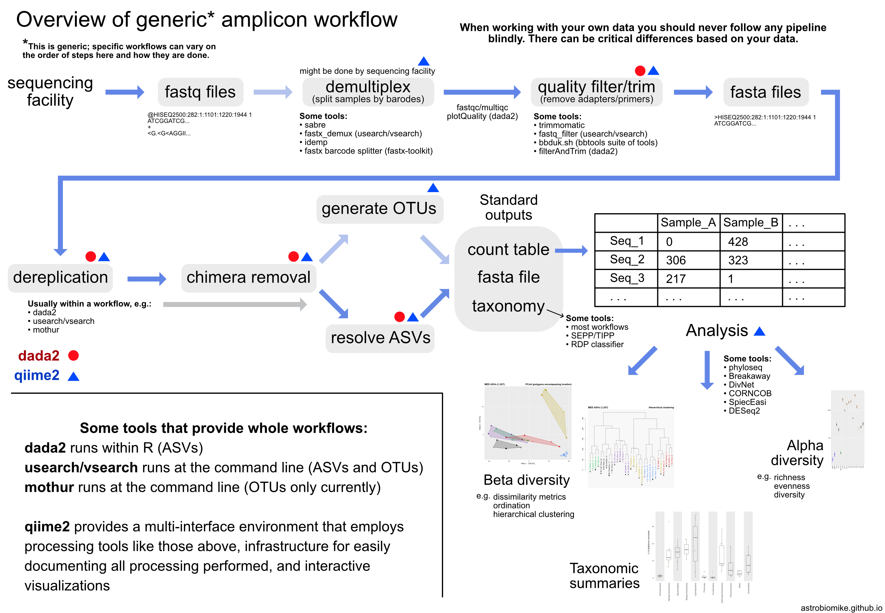

--- 
title: "扩增子测序数据分析"
author: "Hua Zou"
date: "`r Sys.Date()`"
documentclass: krantz
bibliography: ampliconR.bib
biblio-style: apalike
link-citations: yes
colorlinks: yes
lot: yes
lof: yes
site: bookdown::bookdown_site
description: "扩增子测序是环境微生物等研究的主要手段之一，本书出发点是总结经验加深自身对扩增子数据分析的了解"
github-repo: HuaZou/amplicon_analysis
graphics: yes
cover-image: images/coverpage.jpg
---

# 欢迎 {- #welcome}

------

```{asis, echo=identical(knitr:::pandoc_to(), 'html')}
**Note**: 本文内容归本人所有，如需转载请与本人声明。

<p style="text-align: center;"></p>
```

本文涉及到网上众多参考资料，如引起版权纠纷，请立即和我联系 zouhua1@outlook.com。
